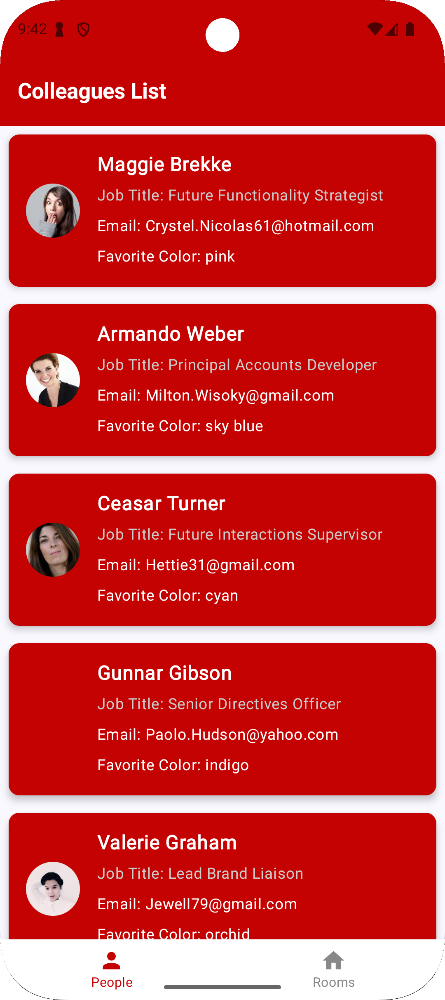

# Virgin Money Directory App - Android

## Overview

This Android application is designed to help Virgin Money staff quickly access colleague contact details and view room occupancy status. It was developed as part of the Virgin Money Developer Challenge, adhering to best practices in Android development, code structure, testability, and accessibility. This project utilizes a multi-module architecture to enhance modularity and maintainability.

## Screenshots

## Features

* **Colleague Directory:**
    * List of all colleagues with basic information.
    * Detailed view of each colleague, including contact details, job title, and other available information.
    * Display of colleague avatars.
* **Room Occupancy:**
    * List of all rooms with their current occupancy status (Available/Occupied).
    * Display of room details such as ID and max occupancy.
* **Theming:**
    * Uses Virgin Money's primary brand color (`#C40202`) as a base theme.
    * Designed with potential future rebranding in mind, leveraging Material Design theming.
* **Accessibility:**
    * App design considers accessibility features for Android, ensuring usability for all employees.

## Technology Stack

* **Kotlin:** The primary programming language for Android development.
* **Android Jetpack:**
    * **Compose:** Modern UI toolkit for building native Android UI.
    * **Hilt:** Dependency injection library for managing dependencies.
    * **ViewModel:** Manages UI-related data in a lifecycle-conscious way.
    * **StateFlow:** Asynchronous data streams that emit state updates.
    * **Coroutines:** For managing background operations and concurrency.
    * **Navigation Compose:** For navigating between different screens.
* **Coil:** Image loading library for efficient image handling.
* **Retrofit:** Type-safe HTTP client for communicating with the API.
* **Gson:** JSON parser for serializing and deserializing data.
* **JUnit:** Unit testing framework.
* **Espresso:** UI testing framework.

## Architecture

The app follows a clean architecture approach with a multi-module setup to promote separation of concerns, testability, and maintainability.

* **app:** The main application module, responsible for assembling the features.
* **core:** Contains shared components and utilities.
* **data:** Handles data retrieval from the API (remote data source).
* **domain:** Contains the business logic (use cases) and data models.
* **feature_people:** Implements the colleague directory feature.
* **feature_room:** Implements the room occupancy feature.

## Code Structure

<pre>
app/
├── build.gradle.kts
├── src/
│   ├── main/
│   │   ├── AndroidManifest.xml
│   │   ├── java/
│   │   │   └── com/example/virginmoney/
│   │   │       ├── MainActivity.kt
│   │   │       └── VMAndroidApp.kt // Hilt Application
│   │   └── res/
│   │       └── ...
core/
├── build.gradle.kts
├── src/main/java/...
data/
├── build.gradle.kts
├── src/main/java/...
domain/
├── build.gradle.kts
├── src/main/java/...
feature_people/
├── build.gradle.kts
├── src/main/java/...
feature_room/
├── build.gradle.kts
├── src/main/java/...
</pre>

## Testing

The application is designed for testability and includes:

* **Unit Tests:**
    * Tests for individual components within each module, such as use cases, repositories, and ViewModels.
    * These tests verify the logic and behavior of the code in isolation.
* **UI Tests (Espresso):**
    * Tests for UI flows and interactions within each feature module.
    * These tests simulate user actions and verify the UI's response.

## Expansion and Maintainability

The application is built with future expansion and maintainability in mind:

* **Multi-Module Architecture:** The project is organized into distinct modules, making it easier to add new features or modify existing ones without affecting other parts of the application.
* **Clean Architecture:** Separation of concerns within each module makes it easier to add new features or modify existing ones.
* **Dependency Injection:** Hilt is used to manage dependencies, making it easier to replace or mock components for testing or future development.
* **Theming:** Using Material Design theming allows for easy adaptation to future branding changes.
* **Clear Code Style:** The code follows consistent formatting and naming conventions to improve readability and understandability.

## Development Story Considerations

The application addresses the development story requirements as follows:

* **Virgin Money Branding:**
    * The primary brand color (`#C40202`) is used consistently throughout the application's theme.
    * Material Design theming is implemented, allowing for easy adaptation to future branding changes.
* **Employee Access and Contact Details:**
    * The app provides a clear and efficient way for employees to access colleague contact details.
    * All available contact details are displayed in a user-friendly format.
* **Android Device Compatibility and Accessibility:**
    * Compose UI is used to create responsive layouts that adapt to different screen sizes and orientations.
    * Accessibility considerations are taken into account, such as providing content descriptions for images.
* **Future Expansion:**
    * The multi-module architecture and clean architecture make the app easily expandable for future features.
    * The use of dependency injection and testing allows for easier maintenance and modification.
* **Test Environments:**
    * The app's architecture supports test environments by allowing for easy mocking or replacement of dependencies.
* **Developer Onboarding:**
    * The clear code structure, modularity, and comprehensive README file make it easier for new developers to onboard and understand the codebase.

## API Documentation

* **Base URL:** `https://61e947967bc0550017bc61bf.mockapi.io/api/v1/`

* **Endpoints:**

    * `GET /people`: Retrieves a list of all people.
    * `GET /rooms`: Retrieves a list of all rooms.

## Installation

1.  Clone the repository.
2.  Open the project in Android Studio.
3.  Build and run the application on an Android emulator or device.

## Contact

* \[Usman Adarkwa Asante]
* \[usmanadarkwa@gmail.com]
